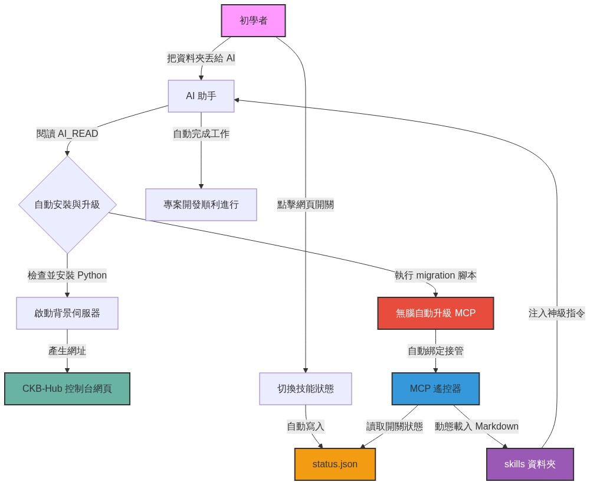

# CKB-Hub 點哥 AI 萬用工具箱：新手完全制霸手冊

歡迎來到 CKB-Hub 的世界！這是一份專為「完全沒有程式背景的初學者」所設計的圖文教材。
在這裡，你會學到如何將你的 AI（如 Cursor 或 Antigravity）升級為擁有 18 項超強專業技能的「神級開發助理」。

---

## 為什麼我們需要 CKB-Hub？

你是不是曾經遇過這些狀況：
* **AI 亂下指令**：明明只是想上傳網站，AI 卻打了一堆你看不懂的黑盒子指令，結果把電腦搞壞了？
* **指令記不住**：每次要部署 Cloudflare 或備份 GitHub，都要去翻舊筆記，或者重新跟 AI 解釋半天？
* **工具包太難裝**：網路上有很多超強的外掛系統（例如 Docker 容器），但安裝過程比登天還難？

**CKB-Hub 就是為了解決這些問題而誕生的！**
它就像是 AI 的「**超強外掛遙控器**」。你不需要背誦任何指令，只要打開網頁、按下一顆按鈕，你的 AI 就會「瞬間學會」那個領域所有的專業知識與安全守則！

---

## 🗺️ 一圖看懂：安裝與運作流程

別擔心安裝很困難，我們把所有的複雜操作都「封裝」起來了。你只需要把資料夾丟給 AI，剩下的它會自己搞定。

> **👇 這是你的專屬安裝與運作流程圖：**

### 流程解析：
1. **無腦安裝**：把這個工具包資料夾丟進 AI 編輯器，AI 會自動閱讀 `AI_READ.md` 啟動升級腳本。
2. **網頁控制台**：AI 會幫你在背景開啟一個安全的網頁 (`http://127.0.0.1:8000`)。
3. **點擊開關**：在網頁上點選你需要的技能（例如「Netlify 一鍵部署」）。
4. **瞬間學會**：系統會在 0.1 秒內把超級指令（Markdown 守則）注入 AI 的大腦，它立刻就能幫你完美工作！

---

## 🦸‍♂️ 18 項神級技能大公開

打開你的控制台網頁，你會看到像「App Store」一樣的精美面板。目前我們內建了六大分類，共 18 種強大技能：

### 1. 基礎設定與助理 (日常必備)
* **點哥專案助理**：這是你的貼身秘書！只要對 AI 說「**開工**」，它就會幫你整理環境；說「**收工**」，它會幫你總結進度並準備備份。
* **API 金鑰管家**：保護你的隱私！確保你的重要密碼不會被不小心上傳到網路上。

### 2. 靜態與主機部署 (讓世界看見你的作品)
不管是想要用 **Cloudflare** 或 **Netlify** 免費發布網站，還是想要用 **GitHub** 穩穩地存檔備份，這裡應有盡有。
如果你想把網站放在自己的主機上，也有 **自訂伺服器部署** 與 **傳統 FTP** 開關可以選！

### 3. 雲端資料庫 (讓網站有記憶)
想要做一個能登入、能留言的網站？打開 **Supabase** 或 **Firebase** 開關，AI 就會變成資料庫專家，帶你一步步串接。

### 4. AI 工具與模型 (魔法擴充)
想把你的程式碼打包丟給 **NotebookLM** 分析？或是想在你的網站裡串接最新的 **Gemini AI** 模型？按鈕點下去就對了。

### 5. 專案與知識庫 (打造第二大腦)
* **Obsidian 同步**：自動把每天的開發日誌轉成 Obsidian 筆記，讓你累積知識不費力。
* **知識庫導航**：為整個專案寫好「導讀地圖」，未來即使換了一台電腦或換了一個 AI，也能一秒進入狀況。

### 6. 診斷與維護 (遇到 Bug 找他們)
* **健檢醫生**：幫你的程式碼做全身健康檢查。
* **疑難排解大師**：卡關超過 30 分鐘？開啟除錯模式，AI 會進入深度思考，幫你找出盲點。

---

## 🧩 終極大絕招：全自動外掛尋找模式

**「如果這 18 個技能還不夠用怎麼辦？」**
別擔心！CKB-Hub 擁有最強大的「**模組化外掛系統**」。你完全不用懂任何 Python 或 HTML 程式碼！

如果你想加掛一個名為「一鍵發文到 IG」的新功能：
1. 打開工具包裡的 `skills/` 資料夾。
2. 複製裡面的 `SKILL_TEMPLATE.md` 樣板。
3. 把你想教 AI 的指令寫進去。
4. **重新整理控制台網頁**，神奇的事情發生了——網頁上已經自動長出了這顆新按鈕，而且 AI 已經學會它了！

---

準備好了嗎？現在就打開終端機輸入 `python main.py`，或是讓你的 AI 幫你喊出「開工」，享受極致流暢的開發體驗吧！
