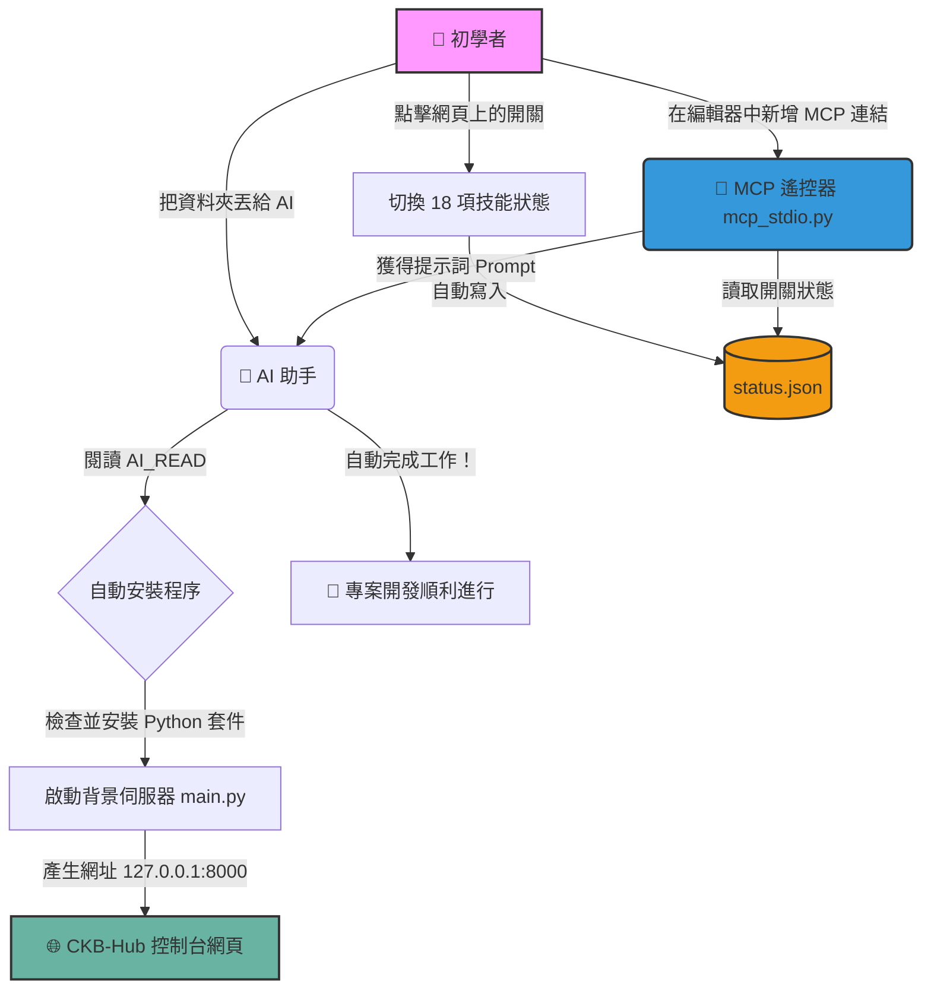

# CKB-Hub 點哥萬用工具箱：使用手冊

CKB-Hub 是一個專門設計給 AI 輔助開發的「魔法開關面板」。只要在網頁上點開特定的開關，AI 就會瞬間學會該技能，並協助你自動化處理各種專案任務。

## 🚀 快速啟動
1. 在終端機進入 `ckb-hub` 資料夾。
2. 輸入 `python main.py` 啟動伺服器。
3. 打開瀏覽器進入 **[http://127.0.0.1:8000](http://127.0.0.1:8000)**。
4. 點擊需要的技能開關，AI 編輯器（如 Cursor / Antigravity）即可無縫獲得該功能。
5. 點擊畫面最下方的「🛑 關閉控制台與背景伺服器」即可安全退出。

---

## 🛠️ 18 項超強 AI 技能清單

我們將技能分類為六大板塊，以下是各板塊的詳細說明：

### 1️⃣ 基礎設定與助理 (Base Settings & Assistant)
- **01. 點哥專案助理 (核心)**：你的貼身管家。自動幫你建立專案結構、管理進度表，當你喊出「開工」或「收工」時，自動為你記錄進度並準備環境。
- **API 金鑰管家**：負責安全地引導你配置環境變數 (`.env`)，自動掃描並檢查是否有缺漏的重要金鑰，避免敏感資料外洩至 GitHub。

### 2️⃣ 靜態與主機部署 (Deploy & Hosting)
- **Cloudflare 網頁部署**：高速發布神器。讓 AI 直接幫你操作 Wrangler CLI，將專案一鍵部署至 Cloudflare Pages 或 Workers，支援臨時隧道與正式發布。
- **Netlify 一鍵部署**：最受歡迎的靜態網站發布通道，免打指令即可發布。
- **GitHub 自動備份**：提供穩定的防護備份 API，不再因為 AI 打錯 Git 指令導致版本庫大亂。
- **Google Apps Script 部署**：支援使用 Clasp 工具將本地端程式碼安全推送到 GAS 專案。
- **自訂伺服器部署**：讓 AI 幫你寫 SSH 或 RSYNC 自動腳本，部署至自訂的 VPS 虛擬主機。
- **傳統虛擬主機 FTP**：給傳統空間使用的自動 FTP 腳本產生器，把打包好的靜態檔案上傳。
- **PHP 專案 FTP 部署**：專為 PHP 開發者設計，會自動避開巨大 `vendor/` 目錄的 FTP 傳輸工具。

### 3️⃣ 雲端資料庫 (Cloud Databases)
- **Supabase 資料庫**：引導串接開源最強的 Postgres 資料庫，協助設定 RLS 權限與資料表結構。
- **Firebase 服務**：Google 的王牌資料庫與驗證服務，協助初始化 SDK 確保 Firestore 連線順暢。

### 4️⃣ AI 工具與模型 (AI & Models)
- **匯出至 NotebookLM**：將整個專案的程式碼打包成一份容易閱讀的 Markdown 文本，方便匯入 Google NotebookLM 閱讀與分析。
- **Gemini API 串接**：教你如何申請與在專案中實作最新版 Google Gemini AI 模型。

### 5️⃣ 專案與知識庫 (Project & Knowledge)
- **Obsidian 知識庫同步**：AI 會把這幾天的開發歷程，轉化為 Obsidian 雙向連結格式，讓你建立最強第二大腦。
- **專案知識庫導航**：在你的專案建立導讀文件，讓未來的自己或是新的 AI 能夠在一秒鐘內看懂整個專案的架構。

### 6️⃣ 診斷與維護 (Diagnostics & Maintenance)
- **專案健檢醫生**：對全專案進行「靜態分析健康檢查」，找出效能瓶頸與語法錯誤，預防勝於治療。
- **套件衝突排解專家**：遇到 npm 或 pip 的套件版本衝突地獄時，開啟它！它專治各種套件死結與更新錯誤。
- **疑難排解大師**：當你卡關超過 30 分鐘，開啟此模式，AI 會進入深度除錯狀態，分析 Log 並提出超過 3 種以上的突圍方案。

---

## 🔧 進階：我要怎麼修改這些開關的內容？

如果你想要修改這 18 個開關的描述，或是新增自己的開關，請參考以下三個檔案（它們就是構成這個工具箱的靈魂）：

1. **`main.py`**：控制後端的預設狀態，尋找 `default_status` 字典，修改裡面的 ID 名稱。
2. **`static/index.html`**：控制網頁前端。尋找 `
` 區塊，修改標題、敘述文字。
3. **`mcp_stdio.py`**：控制 AI 的大腦。這是最關鍵的地方，裡面有 18 個 `@mcp.tool()` 函式。只要去修改裡面 `return "[SUCCESS] ..."` 的文字，AI 在接收到你的啟動命令後，就會看到你寫的新提示！

---

## 🗺️ CKB-Hub 運作原理流程圖

為了讓你更清楚知道我們是怎麼運作的，這裡有一張給初學者看的操作流程圖：

---

## 📂 學習資源 (給初學者的基礎補給站)

對於完全沒有程式基礎的新手，這裡整理了一些你必須知道的基礎概念，幫助你更好地使用 AI 工具：
1. **終端機 (Terminal)**：這就像是電腦的「大腦直達通道」，在這裡輸入指令（例如 `python main.py`），電腦就會不折不扣地執行。我們工具箱的背景伺服器就是在這裡運行的。
2. **本機伺服器 (Localhost / 127.0.0.1)**：當你在瀏覽器輸入 `127.0.0.1`，代表你在訪問「自己的電腦」，而不是網路上的別台主機。我們的控制台網頁就是架設在你自己的電腦上，沒有網路也能開！
3. **GitHub 與版本控制**：把它想像成「程式碼的時光機」。每次 AI 幫你備份 (Commit)，就像是在玩遊戲時存檔，萬一程式搞砸了，隨時可以讀檔重來。
4. **環境變數 (.env)**：這就像是保險箱的鑰匙。我們把 API 金鑰、密碼等機密資訊放在 `.env` 檔案中，而這個檔案絕對不會被上傳到網路上，藉此保護你的隱私安全。
5. **Cloudflare 臨時部署 (Wrangler)**：剛寫好一個網頁想馬上傳給朋友看，但又不想買網址、租主機怎麼辦？Cloudflare 提供了超強的「臨時部署」功能。透過 AI 幫你啟動，你的電腦會瞬間產生一個專屬的神秘臨時網址。只要你不關閉系統，全世界的人都能透過這條秘密通道連線看你的作品！這是初學者展示心血結晶的最快神器。

> 💡 **完整詳細說明**：請參考點哥專案中的 `點哥AI全能工具箱.md` 或 `GUIDE.md` 教學文件。

---

## 👨‍💻 關於作者

**點哥（昇鴻）** — 哲學與生命教育背景的程式設計教師、正念催眠培訓師。
相信「程式是表達思想的工具」，致力於讓完全不會寫程式的人也能透過 AI 實現自己的想法。

* **GitHub**: [https://github.com/ckhotgav](https://github.com/ckhotgav)
* **Facebook**: [https://facebook.com/jshpapa](https://facebook.com/jshpapa)
